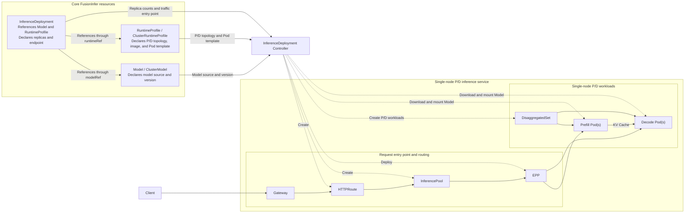
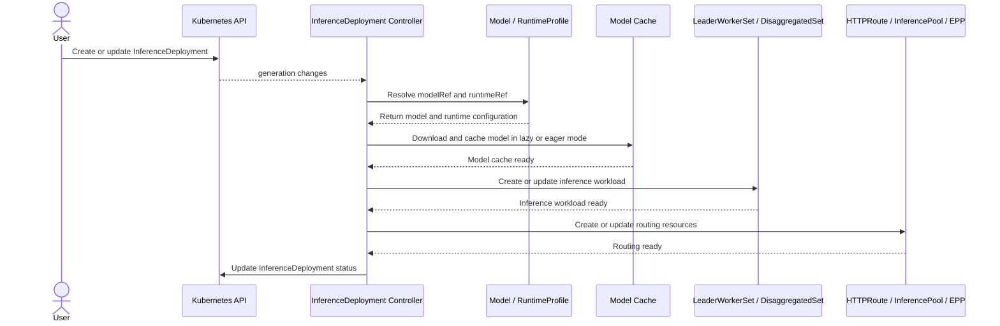

FusionInfer separates model inference into three conceptual resources with distinct responsibilities:

- [`Model` / `ClusterModel`](./model.md) declares the source and immutable version of a model artifact.
- [`RuntimeProfile` / `ClusterRuntimeProfile`](./runtime-profile.md) defines how each replica runs.
- [`InferenceDeployment`](./inference-deployment.md) binds a Model to a RuntimeProfile and declares replica counts, cache policy, and access endpoint.

FusionInfer uses these three resources to create and continuously manage model inference services. This includes downloading and caching models, orchestrating inference workloads, configuring traffic routing, and exposing inference endpoints to users. The same Model or RuntimeProfile can be reused by multiple InferenceDeployment resources; each InferenceDeployment independently declares its replica counts, cache mode, and traffic entry point.

The following single-node Prefill/Decode disaggregation example shows how the three core resources produce Pod workloads and how requests enter the inference service through a Gateway and EPP.



## Core Resources {#core-resources}

### Model {#model}

`Model` / `ClusterModel` declare reusable, immutable model artifacts. The following example declares a Hugging Face model in the `team-a` Namespace and pins its version with a full commit SHA.

```yaml {8}
apiVersion: fusioninfer.io/v1alpha1
kind: Model
metadata:
  name: qwen3-8b-r1
  namespace: team-a
spec:
  source:
    uri: hf://Qwen/Qwen3-8B # Model artifact source
    revision: 0123456789abcdef0123456789abcdef01234567
```

For the detailed design, see [Model and ClusterModel](./model.md).

### RuntimeProfile {#runtimeprofile}

`RuntimeProfile` / `ClusterRuntimeProfile` define how a single logical replica runs, including Aggregated, Prefill/Decode disaggregation, and multi-node execution. The following example declares a single-node Aggregated vLLM runtime template that uses one GPU.

```yaml {15,28}
apiVersion: fusioninfer.io/v1alpha1
kind: RuntimeProfile
metadata:
  name: vllm-aggregated-r1
  namespace: team-a
spec:
  backend: vllm
  aggregated:
    podTemplate:
      spec:
        containers:
          - name: engine
            image: vllm/vllm-openai:v0.26.0
            args:
              - $(FUSION_MODEL_PATH) # The Controller injects the model path from the node cache
            ports:
              - name: http
                containerPort: 8000
            readinessProbe:
              httpGet:
                path: /health
                port: http
            resources:
              requests:
                cpu: "4"
                memory: 16Gi
              limits:
                nvidia.com/gpu: "1" # One GPU per logical replica
```

For the detailed design, see [RuntimeProfile and ClusterRuntimeProfile](./runtime-profile.md).

### InferenceDeployment {#inferencedeployment}

`InferenceDeployment` binds a Model to a RuntimeProfile and serves as the entry point for the Controller to create a model-serving instance. The following example references the two preceding Namespaced objects, creates two Aggregated logical replicas, and publishes an OpenAI-compatible endpoint through a Gateway in the same Namespace.

```yaml {7,10,14-15}
apiVersion: fusioninfer.io/v1alpha1
kind: InferenceDeployment
metadata:
  name: qwen3-8b-chat
  namespace: team-a
spec:
  modelRef: # References Model
    kind: Model
    name: qwen3-8b-r1
  runtimeRef: # References RuntimeProfile
    kind: RuntimeProfile
    name: vllm-aggregated-r1
  replicas:
    aggregated: 2 # Declares two logical replicas
  endpoint: # Declares the inference service entry point
    gatewayRef:
      name: inference-gateway
    hostnames:
      - qwen3-8b.example.com
    endpointPicker:
      strategy: prefix-cache
```

For the detailed design, see [InferenceDeployment](./inference-deployment.md).

## Routing {#routing}

After an inference service is deployed, its inference endpoint needs to be exposed to users or Agents. FusionInfer integrates with the [Gateway API Inference Extension](https://gateway-api-inference-extension.sigs.k8s.io/) to generate an HTTPRoute, InferencePool, and EPP from `InferenceDeployment.spec.endpoint`, and attaches the HTTPRoute to an existing Gateway. The EPP routes requests to available inference Pods according to the configured strategy.

For the detailed design, see [InferenceDeployment Endpoint](./inference-deployment.md#endpoint).

## Reconciliation Flow {#reconciliation-flow}

The Controller reconciles `InferenceDeployment` in the following stages:

- **Resolve resources**: Read the Model and RuntimeProfile referenced by `modelRef` and `runtimeRef`.
- **Prepare the model**: Download the model according to the cache policy and ensure that the model cache is available.
- **Orchestrate workloads**: Create or update LeaderWorkerSet / DisaggregatedSet and wait for the workloads to become ready.
- **Configure routing**: Create or update the HTTPRoute, InferencePool, and EPP.
- **Update status**: Write the reconciliation result to `InferenceDeployment.status`.


