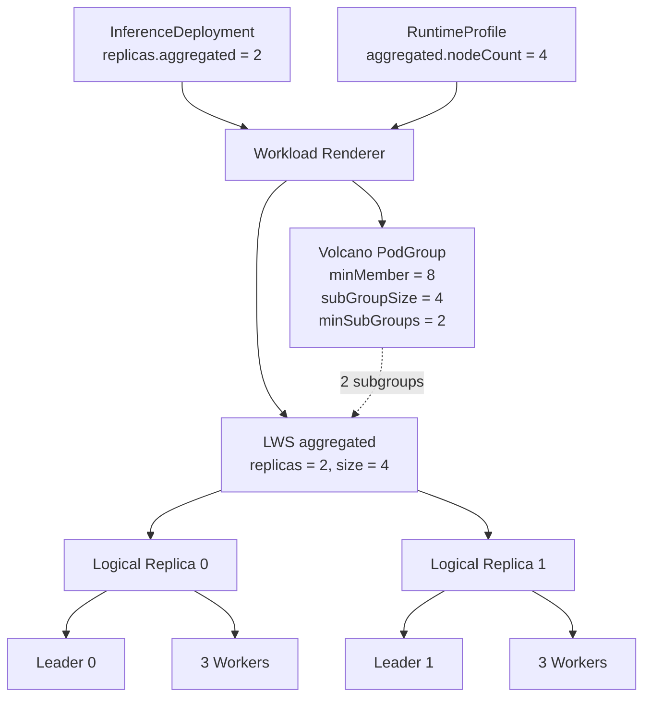
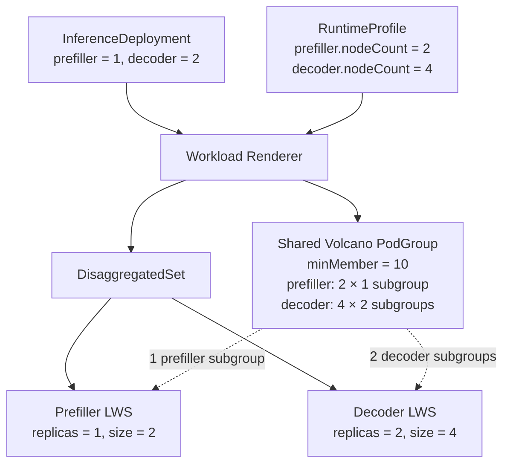

## Design Scope {#design-scope}

FusionInfer generates LeaderWorkerSet (LWS), DisaggregatedSet, and Volcano PodGroup resources from the per-replica runtime configuration defined by [`RuntimeProfile`](./runtime-profile.md) and the replica counts defined by [`InferenceDeployment`](./inference-deployment.md).

## Core Concepts {#core-concepts}

InferenceDeployment uses `replicas.<role>` to control how many replicas run for each role. In multinode scenarios, a replica can consist of multiple Pods that together form a logical replica:

- A single-node logical replica contains one Pod.
- A multinode logical replica contains one Leader Pod and one or more Worker Pods.

RuntimeProfile defines how each logical replica runs:

- `podTemplate` defines the image, resources, and engine parameters for the Pods in the replica.
- `multinode.nodeCount` defines how many Pods the replica contains.
  - When `multinode` is not set, `nodeCount` is treated as 1.
  - With `nodeCount: 4`, one replica contains one Leader and three Workers.

`nodeCount: 4` in the RuntimeProfile means that each logical replica contains four Pods:

```yaml {10}
apiVersion: fusioninfer.io/v1alpha1
kind: RuntimeProfile
metadata:
  name: vllm-aggregated-4node-r1
  namespace: team-a
spec:
  backend: vllm
  aggregated:
    multinode:
      nodeCount: 4
    podTemplate:
      spec:
        containers:
          - name: engine
            image: vllm/vllm-openai:v0.27.1
            args:
              - $(FUSION_MODEL_PATH)
              - --tensor-parallel-size
              - "8"
              - --pipeline-parallel-size
              - "4"
              - --data-parallel-size
              - "1"
            ports:
              - name: http
                containerPort: 8000
            resources:
              limits:
                nvidia.com/gpu: "8"
```

`aggregated: 2` in the InferenceDeployment means that two replicas run with the configuration above:

```yaml {16}
apiVersion: fusioninfer.io/v1alpha1
kind: InferenceDeployment
metadata:
  name: qwen3-70b
  namespace: team-a
spec:
  modelRef:
    kind: ClusterModel
    name: qwen3-70b-r1
  runtimeRef:
    kind: RuntimeProfile
    name: vllm-aggregated-4node-r1
  cache:
    mode: eager
  replicas:
    aggregated: 2
  endpoint:
    gatewayRef:
      name: inference-gateway
      namespace: gateway-system
      sectionName: https
    hostnames:
      - qwen3-70b.example.com
    endpointPicker:
      strategy: prefix-cache
```

The resulting resources contain:

```text
logical replica 0: 1 Leader + 3 Workers
logical replica 1: 1 Leader + 3 Workers

total Pods: 2 × 4 = 8
```

## Aggregated Mode {#aggregated-mode}

Aggregated mode generates one LeaderWorkerSet:

- The LWS `spec.replicas` equals `InferenceDeployment.spec.replicas.aggregated`.
- Each LWS group represents one Aggregated logical replica.
- `leaderWorkerTemplate.size` equals `nodesPerReplica(aggregated)`.
- `workerTemplate` is always present. For multinode replicas, `leaderTemplate` is generated as well; both derive from the same RuntimeProfile `podTemplate`.
- The LWS uses `startupPolicy: LeaderCreated` so that Volcano can observe all Pods in a replica at the same time.
- Only the Leader Pod is registered with the inference Service and as an InferencePool Endpoint.

Volcano uses the LWS logical replica identity to recognize the Leader and Workers in the same group as one subgroup. Even a single-node logical replica uses an LWS with `size: 1`, allowing single-node and multinode replicas to share the same lifecycle, status aggregation, and routing-selection implementation.

The following configuration uses two logical replicas, each spanning four nodes:

```yaml
apiVersion: fusioninfer.io/v1alpha1
kind: RuntimeProfile
metadata:
  name: vllm-aggregated-4node-r1
  namespace: team-a
spec:
  backend: vllm
  aggregated:
    multinode:
      nodeCount: 4
    podTemplate:
      spec:
        containers:
          - name: engine
            image: vllm/vllm-openai:v0.27.1
            args:
              - $(FUSION_MODEL_PATH)
              - --port
              - "8000"
              - --tensor-parallel-size
              - "8"
              - --pipeline-parallel-size
              - "4"
              - --data-parallel-size
              - "1"
            ports:
              - name: http
                containerPort: 8000
            resources:
              limits:
                nvidia.com/gpu: "8"
        nodeSelector:
          accelerator: h100
---
apiVersion: fusioninfer.io/v1alpha1
kind: InferenceDeployment
metadata:
  name: qwen3-70b
  namespace: team-a
spec:
  modelRef:
    kind: ClusterModel
    name: qwen3-70b-r1
  runtimeRef:
    kind: RuntimeProfile
    name: vllm-aggregated-4node-r1
  cache:
    mode: eager
  replicas:
    aggregated: 2
  endpoint:
    gatewayRef:
      name: inference-gateway
      namespace: gateway-system
      sectionName: https
    hostnames:
      - qwen3-70b.example.com
    endpointPicker:
      strategy: prefix-cache
```

The RuntimeProfile fixes `nodeCount: 4` and eight GPUs per Pod, while the InferenceDeployment only sets the number of logical replicas to 2. The Controller therefore derives `2 × 4 = 8` Pods and `8 × 8 = 64` GPUs, creates an LWS with `replicas: 2` and `size: 4`, and places both LWS groups in the same revision-scoped PodGroup.



### PodGroup {#podgroup}

`minMember: 8` is the global minimum Pod count for the revision. `subGroupPolicy` then groups the four Pods in each LWS logical replica into an atomic scheduling unit:

```yaml
apiVersion: scheduling.volcano.sh/v1beta1
kind: PodGroup
metadata:
  name: qwen3-70b
  namespace: team-a
spec:
  minMember: 8
  minResources:
    nvidia.com/gpu: "64"
  subGroupPolicy:
    - name: aggregated
      labelSelector:
        matchLabels:
          fusioninfer.io/role: aggregated
      matchLabelKeys:
        - leaderworkerset.sigs.k8s.io/group-index
      subGroupSize: 4
      minSubGroups: 2
```

At runtime, `minResources` aggregates the resource requests from the RuntimeProfile that participate in gang scheduling; the example shows only GPUs. `minSubGroups: 2` corresponds to the Deployment's `replicas.aggregated: 2`, meaning that the PodGroup meets the role's minimum only when both complete four-Pod subgroups are present.

### LeaderWorkerSet {#leaderworkerset}

The two logical replicas are represented by `spec.replicas` in the same LWS. The LWS configuration and the backend-generated differences between Leader and Worker startup are as follows:

```yaml
apiVersion: leaderworkerset.x-k8s.io/v1
kind: LeaderWorkerSet
metadata:
  name: qwen3-70b-aggregated
  namespace: team-a
spec:
  replicas: 2
  startupPolicy: LeaderCreated
  rolloutStrategy:
    type: RollingUpdate
  leaderWorkerTemplate:
    size: 4
    leaderTemplate:
      spec:
        schedulerName: volcano
        containers:
          - name: engine
            image: vllm/vllm-openai:v0.27.1
            command:
              - vllm
              - serve
            args:
              - $(FUSION_MODEL_PATH)
              - --tensor-parallel-size
              - "8"
              - --pipeline-parallel-size
              - "4"
              - --data-parallel-size
              - "1"
              - --distributed-executor-backend
              - mp
              - --nnodes
              - "4"
              - --master-addr
              - $(LWS_LEADER_ADDRESS)
              - --master-port
              - "29500"
              - --node-rank
              - "0"
            ports:
              - name: http
                containerPort: 8000
            resources:
              limits:
                nvidia.com/gpu: "8"
    workerTemplate:
      spec:
        schedulerName: volcano
        containers:
          - name: engine
            image: vllm/vllm-openai:v0.27.1
            command:
              - vllm
              - serve
            args:
              - $(FUSION_MODEL_PATH)
              - --tensor-parallel-size
              - "8"
              - --pipeline-parallel-size
              - "4"
              - --data-parallel-size
              - "1"
              - --distributed-executor-backend
              - mp
              - --nnodes
              - "4"
              - --master-addr
              - $(LWS_LEADER_ADDRESS)
              - --master-port
              - "29500"
              - --node-rank
              - $(LWS_WORKER_INDEX)
              - --headless
            resources:
              limits:
                nvidia.com/gpu: "8"
```

The LWS Controller creates two groups from this object. Each group contains one Leader and three Workers, and receives in-group discovery information such as `LWS_LEADER_ADDRESS`:

```text
logical replica 0: 1 Leader + 3 Workers
logical replica 1: 1 Leader + 3 Workers
```

Volcano recognizes these as two four-Pod subgroups. A single-node Aggregated deployment uses the same PodGroup structure, except that each subgroup has a `subGroupSize` of 1.

## Disaggregated P/D Mode {#disaggregated-pd-mode}

A Prefill/Decode Profile contains both `prefiller` and `decoder`. The Controller generates one DisaggregatedSet for the entire P/D revision; each role maps to a LeaderWorkerSet managed by the DisaggregatedSet. The two roles can have different Pod templates, logical replica counts, and `nodeCount` values. The DisaggregatedSet owns the unified revision, coordinated rollout, role status, and Headless Service.

This mapping requires LeaderWorkerSet v0.9.0 or later, including the `disaggregatedset.x-k8s.io/v1` CRD, to be installed in the cluster. The Controller discovers this API at startup. If it is missing, the P/D InferenceDeployment sets `WorkloadsReady=False` with reason `DisaggregatedSetUnavailable`.

The following configuration assigns two nodes to each Prefiller replica and four nodes to each Decoder replica. The InferenceDeployment requests one Prefiller replica and two Decoder replicas:

```yaml
apiVersion: fusioninfer.io/v1alpha1
kind: ClusterRuntimeProfile
metadata:
  name: vllm-pd-2x4-h100-r1
spec:
  backend: vllm
  prefiller:
    multinode:
      nodeCount: 2
    podTemplate:
      spec:
        containers:
          - name: engine
            image: vllm/vllm-openai:v0.27.1
            args:
              - $(FUSION_MODEL_PATH)
              - --port
              - "8000"
              - --tensor-parallel-size
              - "16"
              - --data-parallel-size
              - "1"
              - --kv-transfer-config
              - '{"kv_connector":"NixlConnector","kv_role":"kv_producer"}'
            ports:
              - name: http
                containerPort: 8000
            resources:
              limits:
                nvidia.com/gpu: "8"
        nodeSelector:
          accelerator: h100
  decoder:
    multinode:
      nodeCount: 4
    podTemplate:
      spec:
        containers:
          - name: engine
            image: vllm/vllm-openai:v0.27.1
            args:
              - $(FUSION_MODEL_PATH)
              - --port
              - "8000"
              - --tensor-parallel-size
              - "8"
              - --pipeline-parallel-size
              - "4"
              - --data-parallel-size
              - "1"
              - --kv-transfer-config
              - '{"kv_connector":"NixlConnector","kv_role":"kv_consumer"}'
            ports:
              - name: http
                containerPort: 8000
            resources:
              limits:
                nvidia.com/gpu: "8"
        nodeSelector:
          accelerator: h100
---
apiVersion: fusioninfer.io/v1alpha1
kind: InferenceDeployment
metadata:
  name: qwen3-pd
  namespace: team-a
spec:
  modelRef:
    kind: ClusterModel
    name: qwen3-70b-r1
  runtimeRef:
    kind: ClusterRuntimeProfile
    name: vllm-pd-2x4-h100-r1
  cache:
    mode: eager
  replicas:
    prefiller: 1
    decoder: 2
  endpoint:
    gatewayRef:
      name: inference-gateway
      namespace: gateway-system
      sectionName: https
    hostnames:
      - qwen3-pd.example.com
```

`endpoint.endpointPicker` is omitted because P/D routing is inferred from the `prefiller + decoder` role combination. The Pod count for each role is calculated from its own `nodeCount` and `replicas`:

```text
prefiller pods = 1 × 2 = 2
decoder pods   = 2 × 4 = 8
total pods     = 10
```



### PodGroup {#podgroup-1}

Both P/D roles join the same PodGroup, but each has an independent subgroup rule:

```yaml
apiVersion: scheduling.volcano.sh/v1beta1
kind: PodGroup
metadata:
  name: qwen3-pd
  namespace: team-a
spec:
  minMember: 10
  subGroupPolicy:
    - name: prefiller
      labelSelector:
        matchLabels:
          fusioninfer.io/role: prefiller
      matchLabelKeys:
        - leaderworkerset.sigs.k8s.io/group-index
      subGroupSize: 2
      minSubGroups: 1
    - name: decoder
      labelSelector:
        matchLabels:
          fusioninfer.io/role: decoder
      matchLabelKeys:
        - leaderworkerset.sigs.k8s.io/group-index
      subGroupSize: 4
      minSubGroups: 2
```

This configuration requires at least one complete Prefiller subgroup and two complete Decoder subgroups. `minMember: 10` also requires all ten Pods across the three subgroups to enter the PodGroup's minimum scheduling set.

### DisaggregatedSet {#disaggregatedset}

The InferenceDeployment Controller compiles the two RuntimeProfile roles into the same DisaggregatedSet. The role, replica, and node-count mapping is as follows:

```yaml
apiVersion: disaggregatedset.x-k8s.io/v1
kind: DisaggregatedSet
metadata:
  name: qwen3-pd
  namespace: team-a
spec:
  roles:
    - name: prefiller
      spec:
        replicas: 1
        startupPolicy: LeaderCreated
        leaderWorkerTemplate:
          size: 2
          leaderTemplate:
            spec:
              schedulerName: volcano
              containers:
                - name: engine
                  image: vllm/vllm-openai:v0.27.1
          workerTemplate:
            spec:
              schedulerName: volcano
              containers:
                - name: engine
                  image: vllm/vllm-openai:v0.27.1

    - name: decoder
      spec:
        replicas: 2
        startupPolicy: LeaderCreated
        leaderWorkerTemplate:
          size: 4
          leaderTemplate:
            spec:
              schedulerName: volcano
              containers:
                - name: engine
                  image: vllm/vllm-openai:v0.27.1
          workerTemplate:
            spec:
              schedulerName: volcano
              containers:
                - name: engine
                  image: vllm/vllm-openai:v0.27.1
```

The DisaggregatedSet Controller generates one child LWS for each role and manages the coordinated rollout and Headless Service for both roles.

### Role LeaderWorkerSets {#role-leaderworkersets}

The DisaggregatedSet creates one LWS for each role. The key mapping is as follows:

```yaml
# Prefiller
kind: LeaderWorkerSet
spec:
  replicas: 1
  startupPolicy: LeaderCreated
  leaderWorkerTemplate:
    size: 2
---
# Decoder
kind: LeaderWorkerSet
spec:
  replicas: 2
  startupPolicy: LeaderCreated
  leaderWorkerTemplate:
    size: 4
```

The Prefiller LWS creates one two-Pod logical replica, while the Decoder LWS creates two four-Pod logical replicas. The Leader and Worker startup configurations in the role templates derive from the same RuntimeProfile `podTemplate` and backend adapter.

Even when every logical replica is single-node, a P/D deployment uses a shared PodGroup to coordinate the minimum available set of Prefillers and Decoders. The DisaggregatedSet manages the role workloads, while FusionInfer manages model materialization, the shared PodGroup, and GAIE routing. The Endpoint Picker and InferencePool switch traffic only after all desired roles in the pending revision are ready.

## Backend Distributed Execution {#backend-distributed-execution}

RuntimeProfile supplies one `podTemplate` for each inference role. The Controller generates Leader and Worker configurations from the template, and the backend adapter then modifies the startup arguments of the `engine` container. `backend` selects only the adapter; it does not select the image, model, or parallelism.

### Leader and Worker Startup {#leader-and-worker-startup}

When `multinode` is not set, the adapter does not add cross-node startup arguments. When `multinode` is set, the same template produces two role-specific configurations:

- The Leader uses rank 0, establishes the distributed execution environment, and starts the inference process that serves HTTP externally.
- Each Worker joins the Leader at the rank assigned by LWS and is not registered with the Service or as an InferencePool Endpoint.
- The image, TP/PP/DP, resources, environment variables, volumes, and scheduling constraints come from the original `podTemplate`.
- When a Worker does not run an HTTP service, the adapter removes the HTTP readiness, liveness, and startup probes inherited from the original template.

LeaderWorkerSet provides the following in-group information:

```text
LWS_LEADER_ADDRESS   In-group address of the Leader Pod
LWS_WORKER_INDEX     Index of the Worker in the current group
LWS_GROUP_SIZE       Total number of Pods in the current group
```

The backend adapter translates these values into engine-specific executor, address, rank, and node-count arguments. RuntimeProfile cannot declare adapter-managed executor, address, rank, `nnodes`, or headless arguments; if a conflict occurs, the Controller rejects workload generation.

### vLLM {#vllm}

Multinode vLLM always uses the native multiprocessing executor. RuntimeProfile declares only the model and engine parameters such as TP/PP/DP; the backend adapter injects `--distributed-executor-backend mp` and the in-group startup arguments into each Pod.

Every Pod runs `vllm serve`. The Leader uses:

```text
--distributed-executor-backend mp
--nnodes 4
--master-addr $(LWS_LEADER_ADDRESS)
--master-port 29500
--node-rank 0
```

Each Worker uses the same model and parallelism arguments and joins the distributed process group in headless mode:

```text
--distributed-executor-backend mp
--nnodes 4
--master-addr $(LWS_LEADER_ADDRESS)
--master-port 29500
--node-rank $(LWS_WORKER_INDEX)
--headless
```

The Leader serves HTTP externally, while Workers participate only in distributed execution. Before starting a Worker, the adapter waits for the Leader's multiprocessing rendezvous port to become available. TP/PP/DP retain their original RuntimeProfile values and are not adjusted automatically based on `nodeCount`.

### SGLang {#sglang}

SGLang uses its native distributed launch. The Profile author declares the model parameters, `--tp-size`, `--dp-size`, and per-Pod GPU resources, while the adapter adds `dist-init-addr`, `nnodes`, and `node-rank` to each Pod.

The Leader uses:

```bash
python3 -m sglang.launch_server \
  --model-path "${FUSION_MODEL_PATH}" \
  --tp-size 16 \
  --dp-size 1 \
  --dist-init-addr "${LWS_LEADER_ADDRESS}:29500" \
  --nnodes 2 \
  --node-rank 0
```

Each Worker uses the same engine parameters, with only the rank substituted:

```bash
python3 -m sglang.launch_server \
  --model-path "${FUSION_MODEL_PATH}" \
  --tp-size 16 \
  --dp-size 1 \
  --dist-init-addr "${LWS_LEADER_ADDRESS}:29500" \
  --nnodes 2 \
  --node-rank "${LWS_WORKER_INDEX}"
```

Only rank 0 serves HTTP. The other ranks run the SGLang scheduler and distributed compute processes but are not registered as routable Endpoints.

### Parameter Ownership and Validation {#parameter-ownership-and-validation}

RuntimeProfile owns the model parameters, TP/PP/DP, image, and per-Pod resources. The backend adapter selects the multiprocessing executor for vLLM and adds the address, rank, node count, and headless arguments that vary between Leaders and Workers; LWS provides the in-group address and index.

The adapter accepts only entry-point forms explicitly supported by the Operator version, such as `vllm serve` and `python3 -m sglang.launch_server`. It can recognize a limited, version-constrained set of arguments, but it does not parse arbitrary shell scripts or validate the mathematical compatibility of the model architecture with TP/PP/DP. An unrecognized entry point, duplicate reserved arguments, or an unsupported argument combination leaves the new workload uncreated.

## Gang Scheduling {#gang-scheduling}

Both Aggregated and disaggregated P/D modes use Volcano gang scheduling, whether a replica contains one Pod or multiple Pods.

Before creating a standalone LWS or DisaggregatedSet, the Controller creates a revision-scoped PodGroup. The PodGroup aggregates all logical replicas:

```text
minMember =
    Σ replicas(role) × nodesPerReplica(role)

subGroupPolicy[role].subGroupSize =
    nodesPerReplica(role)

subGroupPolicy[role].minSubGroups =
    replicas(role)
```

The two levels have distinct responsibilities:

- `minMember` is the global minimum Pod count for the entire revision and participates in PodGroup admission together with `minResources`.
- `subGroupPolicy` forms subgroups by role and LWS logical replica.
- `subGroupSize` ensures that the Leader and Workers of a logical replica are scheduled as an atomic unit.
- `minSubGroups` ensures that the scheduling requirements are met for at least the specified number of complete logical replicas for the role.

When replicas are added, the Controller updates `spec.replicas` on the standalone LWS or on the DisaggregatedSet role, and updates the PodGroup's `minMember` and the corresponding role's `minSubGroups`. Each role requires only one `subGroupPolicy`.

### PodGroup Admission Semantics {#podgroup-admission-semantics}

PodGroup uses two levels: global admission and logical-replica atomicity:

- `minMember` defines the minimum Pod count for the entire revision.
- `subGroupSize` defines the number of Pods in each logical replica.
- `minSubGroups` defines the number of complete logical replicas required for the corresponding role.

Two four-node Aggregated replicas correspond to `minMember: 8`, `subGroupSize: 4`, and `minSubGroups: 2`. Each four-Pod logical replica is scheduled as one subgroup, and the two subgroups together form the minimum available set for the revision.

The shared PodGroup's `minMember` covers every desired member of the pending revision, so the revision does not support scheduling only part of the desired capacity. When resources are insufficient, the new LWS remains Pending and the previous active revision continues to receive traffic. This behavior matches the promotion condition that a revision is promoted only after all desired logical replicas are Ready.

The Controller sets each generated Pod's `schedulerName` to the Volcano scheduler configured for the Operator. `schedulerName` in the RuntimeProfile must be unset or match that value; a conflicting value is rejected rather than silently overwritten.

`SubGroupPolicy` requires Volcano v1.14 or later. At startup, the Operator must discover whether the PodGroup CRD includes `spec.subGroupPolicy`. If that capability is missing, the InferenceDeployment sets `WorkloadsReady=False` with reason `UnsupportedVolcanoVersion`; it cannot silently degrade to scheduling with only `minMember`.

## Scaling {#scaling}

Changing only `replicas` in the InferenceDeployment does not change the node count, Pod resources, or engine parameters in the RuntimeProfile:

- Scaling Aggregated replicas updates `spec.replicas` on the standalone LWS.
- Scaling P/D replicas updates `spec.replicas` on the corresponding DisaggregatedSet role, after which the DisaggregatedSet drives the child LWS.
- Scaling out updates the PodGroup's `minMember`, the corresponding role's `subGroupPolicy.minSubGroups`, and `minResources` at the same time; `subGroupSize` remains unchanged.
- Scaling in first stops advertising the Leaders of logical replicas marked for deletion as routable Endpoints, then decreases the role replicas and contracts the PodGroup.
- `nodeCount`, Pod resources, and TP/PP/DP cannot be scaled through the Deployment; these changes require a new RuntimeProfile and a complete revision rollout.

For a deployment using dynamic LoRA, a new logical replica joins the routable Endpoint set only after all declared LoRAs have finished loading. When a replica is removed, new Base Model and LoRA requests are stopped first, then bindings are unloaded and the LWS group is scaled down. Preload mode adds no separate step because the LoRAs already belong to the workload revision.

When the resources required for gang scale-out are unavailable, existing logical replicas continue serving and the Deployment reports `Progressing=True` and `WorkloadsReady=False`. The Controller does not delete existing replicas first to free resources for new replicas.

## Rollout and Failure Handling {#rollout-and-failure-handling}

Changes to the Model, RuntimeProfile, or cache mode produce a new template hash. The Controller creates a separate warm-up job, PodGroup, standalone LWS or DisaggregatedSet, role Services, and Endpoint Picker for the pending revision instead of modifying the active revision's Pod templates in place.

With `loadingMode: preload`, the resolved LoRA references, digests, and `servedName` values participate in the template hash, and binding changes use the same complete rollout. With `loadingMode: dynamic`, the LoRA set uses a separate binding revision; a loading or unloading failure does not replace the Base Model workload or affect other LoRAs that are already Ready.

The new revision is promoted only when all of the following conditions are met:

- The required model copies have been materialized.
- In preload mode, all LoRAs have been materialized and started successfully with the engine.
- The Leader and all Workers in every logical replica are Ready.
- All desired Aggregated or Prefill/Decode logical replicas are Ready.
- The role Services have produced Ready Endpoints.
- The Endpoint Picker and InferencePool are ready.

If the PodGroup cannot be scheduled, the LWS or DisaggregatedSet fails to start, the coordinated role rollout fails, or the backend adapter rejects the template, the Controller retains the active revision and reports the failure reason through InferenceDeployment Conditions. Deleting an InferenceDeployment also reclaims its workload and routing resources; node model caches are reclaimed independently according to the global retention policy.

## Status Mapping {#status-mapping}

`InferenceDeployment.status.components.<role>` aggregates the underlying status by logical replica:

- `desiredReplicas` comes from `spec.replicas.<role>`.
- `nodesPerReplica` comes from the RuntimeProfile's `multinode.nodeCount`, or 1 when it is not set.
- Aggregated `readyReplicas` comes from the group Ready status of the standalone LWS.
- The `readyReplicas` values for Prefiller and Decoder come from the DisaggregatedSet role status and the corresponding child LWS; a group counts only when all of its member Pods are Ready.
- `readyPods` records the current total number of Ready Pods.

Users observe workload reconciliation results through the `WorkloadsReady`, `Progressing`, and `Degraded` Conditions.
