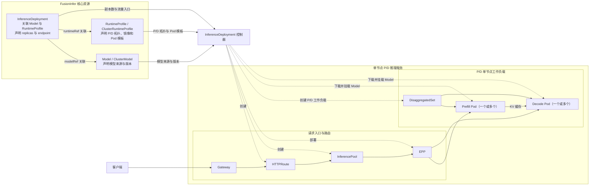
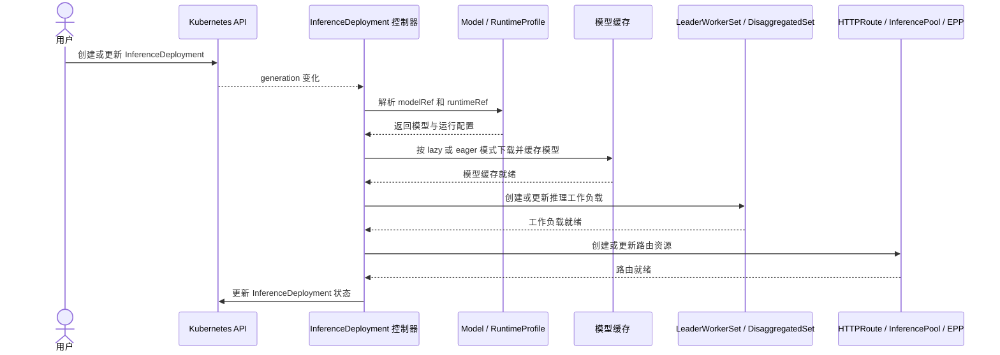

FusionInfer 将模型推理拆分为三个职责独立的概念资源：

- [`Model` / `ClusterModel`](./model.md) 声明模型制品的来源和不可变版本。
- [`RuntimeProfile` / `ClusterRuntimeProfile`](./runtime-profile.md) 定义每个副本如何运行。
- [`InferenceDeployment`](./inference-deployment.md) 绑定模型与 RuntimeProfile，并声明副本数、缓存策略和访问入口。

FusionInfer 根据这三个资源创建并持续管理模型推理服务，包括下载和缓存模型、编排推理工作负载、配置流量路由，并向用户提供推理端点。同一个 Model 或 RuntimeProfile 可以被多个 InferenceDeployment 复用；每个 InferenceDeployment 独立声明副本数、缓存模式和流量入口。

以下以单节点 Prefill/Decode 分离为例，展示三个核心资源如何生成 Pod 工作负载，以及请求如何通过 Gateway 和 EPP 进入推理服务。



## 核心资源 {#core-resources}

### Model {#model}

`Model` / `ClusterModel` 声明可复用、不可变的模型制品。下面示例声明一个位于 `team-a` Namespace 的 Hugging Face 模型，并使用完整 commit SHA 固定版本。

```yaml {8}
apiVersion: fusioninfer.io/v1alpha1
kind: Model
metadata:
  name: qwen3-8b-r1
  namespace: team-a
spec:
  source:
    uri: hf://Qwen/Qwen3-8B # 模型制品来源
    revision: 0123456789abcdef0123456789abcdef01234567
```

详细设计见 [Model 与 ClusterModel](./model.md)。

### RuntimeProfile {#runtimeprofile}

`RuntimeProfile` / `ClusterRuntimeProfile` 定义单个逻辑副本如何运行，包括 Aggregated、Prefill/Decode 分离和多节点运行方式。下面示例声明一个使用单张 GPU 的单节点 Aggregated vLLM 运行模板。

```yaml {15,28}
apiVersion: fusioninfer.io/v1alpha1
kind: RuntimeProfile
metadata:
  name: vllm-aggregated-r1
  namespace: team-a
spec:
  backend: vllm
  aggregated:
    podTemplate:
      spec:
        containers:
          - name: engine
            image: vllm/vllm-openai:v0.27.1
            args:
              - $(FUSION_MODEL_PATH) # 控制器注入节点缓存中的模型路径
            ports:
              - name: http
                containerPort: 8000
            readinessProbe:
              httpGet:
                path: /health
                port: http
            resources:
              requests:
                cpu: "4"
                memory: 16Gi
              limits:
                nvidia.com/gpu: "1" # 每个逻辑副本使用一张 GPU
```

详细设计见 [RuntimeProfile 与 ClusterRuntimeProfile](./runtime-profile.md)。

### InferenceDeployment {#inferencedeployment}

`InferenceDeployment` 绑定 Model 与 RuntimeProfile，是控制器创建模型服务实例的入口。下面示例引用前两个 Namespaced 对象，创建两个 Aggregated 逻辑副本，并通过同 Namespace 的 Gateway 发布 OpenAI 兼容端点。

```yaml {7,10,14-15}
apiVersion: fusioninfer.io/v1alpha1
kind: InferenceDeployment
metadata:
  name: qwen3-8b-chat
  namespace: team-a
spec:
  modelRef: # 关联 Model
    kind: Model
    name: qwen3-8b-r1
  runtimeRef: # 关联 RuntimeProfile
    kind: RuntimeProfile
    name: vllm-aggregated-r1
  replicas:
    aggregated: 2 # 声明两个逻辑副本
  endpoint: # 声明推理服务入口
    gatewayRef:
      name: inference-gateway
    hostnames:
      - qwen3-8b.example.com
    endpointPicker:
      strategy: prefix-cache
```

详细设计见 [InferenceDeployment](./inference-deployment.md)。

## 路由 {#routing}

推理服务部署后，需要将推理端点暴露给用户或智能体。FusionInfer 集成 [Gateway API Inference Extension](https://gateway-api-inference-extension.sigs.k8s.io/)，根据 `InferenceDeployment.spec.endpoint` 生成 HTTPRoute、InferencePool 和 EPP，并将 HTTPRoute 关联到已有 Gateway。EPP 根据配置的策略将请求路由到可用的推理 Pod。

详细设计见 [InferenceDeployment 端点](./inference-deployment.md#endpoint)。

## 调和流程 {#reconciliation-flow}

控制器按以下阶段调和 `InferenceDeployment`：

- **解析资源**：读取 `modelRef` 和 `runtimeRef` 指向的 Model 与 RuntimeProfile。
- **准备模型**：根据缓存策略下载模型，并确保模型缓存可用。
- **编排工作负载**：创建或更新 LeaderWorkerSet / DisaggregatedSet，并等待工作负载就绪。
- **配置路由**：创建或更新 HTTPRoute、InferencePool 和 EPP。
- **更新状态**：将调和结果写入 `InferenceDeployment.status`。


