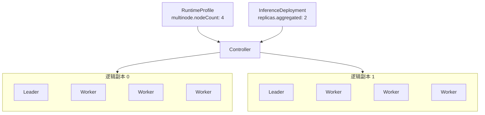

## 概述 {#overview}

`RuntimeProfile` 和 `ClusterRuntimeProfile` 声明可复用的推理运行模板，包括推理引擎（`backend`）、推理镜像和启动参数、LoRA 适配器的加载方式、单节点或多节点部署、Aggregated 或 Prefill/Decode 角色、默认的 Endpoint Picker 策略，以及 P/D 的 KV 传输方式。两者只有作用范围不同：

- `RuntimeProfile` 是 Namespaced 资源，用于 Namespace 内复用。
- `ClusterRuntimeProfile` 是 Cluster-scoped 资源，用于跨 Namespace 共享。

`RuntimeProfile` 和 `ClusterRuntimeProfile` 使用相同的 `RuntimeProfileSpec`。Profile 描述每个角色的单个逻辑副本，不包含部署副本数，也不绑定具体 Model。

下面是一个 Aggregated RuntimeProfile 的示例。它使用 vLLM 推理引擎，Pod 模板中的 `engine` 容器运行 vLLM 镜像，从 Controller 注入的 `$(FUSIONINFER_MODEL_PATH)` 读取模型，并通过名为 `http` 的 8000 端口提供推理服务：

```yaml
apiVersion: fusioninfer.io/v1alpha1
kind: RuntimeProfile
metadata:
  name: vllm-aggregated
  namespace: team-a
spec:
  backend: vllm
  aggregated:
    podTemplate:
      spec:
        containers:
          - name: engine
            image: vllm/vllm-openai:v0.27.1
            args:
              - $(FUSIONINFER_MODEL_PATH)
            ports:
              - name: http
                containerPort: 8000
```

## Spec {#spec}

### API 结构 {#api-structure}

`RuntimeProfile` 与 `ClusterRuntimeProfile` 共享以下 Go 接口：

```go
// RuntimeBackend 是运行时使用的推理引擎。
// +kubebuilder:validation:Enum=vllm;sglang
type RuntimeBackend string

const (
    RuntimeBackendVLLM   RuntimeBackend = "vllm"
    RuntimeBackendSGLang RuntimeBackend = "sglang"
)

// RuntimeProfileSpec 声明可复用的推理运行时，由 RuntimeProfile 与 ClusterRuntimeProfile 共用。
type RuntimeProfileSpec struct {
    Backend        RuntimeBackend        `json:"backend"`
    LoRA           *RuntimeLoRASpec      `json:"lora,omitempty"`
    EndpointPicker *EndpointPickerSpec   `json:"endpointPicker,omitempty"`
    KVTransfer     *KVTransferSpec       `json:"kvTransfer,omitempty"`
    Aggregated     *RuntimeComponentSpec `json:"aggregated,omitempty"`
    Prefiller      *RuntimeComponentSpec `json:"prefiller,omitempty"`
    Decoder        *RuntimeComponentSpec `json:"decoder,omitempty"`
}

// LoRALoadingMode 表示运行时在什么时候加载绑定的 LoRA 适配器。
// +kubebuilder:validation:Enum=preload;dynamic
type LoRALoadingMode string

const (
    LoRALoadingModePreload LoRALoadingMode = "preload"
    LoRALoadingModeDynamic LoRALoadingMode = "dynamic"
)

// RuntimeLoRASpec 声明运行时如何加载 InferenceDeployment 绑定的 LoRA 适配器。
type RuntimeLoRASpec struct {
    LoadingMode LoRALoadingMode `json:"loadingMode"`
}

// EndpointPickerSpec 声明 Endpoint Picker 如何在逻辑副本之间分配请求，InferenceDeployment 也使用这个类型。
type EndpointPickerSpec struct {
    // 复用现有的 v1alpha1 RoutingStrategy 类型，只允许以下三种取值。
    // +kubebuilder:validation:Enum=prefix-cache;kv-cache-utilization;queue-size
    Strategy RoutingStrategy `json:"strategy"`
}

// KVConnector 是把 KV cache 从 Prefiller 传到 Decoder 的 connector。
// +kubebuilder:validation:Enum=nixl
type KVConnector string

const (
    KVConnectorNIXL KVConnector = "nixl"
)

// KVTransferSpec 声明 Prefiller 如何把 KV cache 传给 Decoder。
type KVTransferSpec struct {
    Connector KVConnector `json:"connector"`
}

// RuntimeComponentSpec 声明一个角色：单个逻辑副本的 Pod 模板，以及副本是否跨多个节点。
type RuntimeComponentSpec struct {
    PodTemplate corev1.PodTemplateSpec `json:"podTemplate"`
    Multinode   *MultinodeSpec         `json:"multinode,omitempty"`
}

// MultinodeSpec 声明跨多个节点的逻辑副本，包含一个 Leader 和 nodeCount - 1 个 Worker。
type MultinodeSpec struct {
    // +kubebuilder:validation:Minimum=2
    NodeCount int32 `json:"nodeCount"`
}
```

### 推理模式与角色 {#role-fields}

角色字段的组合决定推理模式：

| 角色字段 | 结果 |
| --- | --- |
| 只设置 `aggregated` | 聚合推理 |
| 同时设置 `prefiller` 和 `decoder` | Prefill/Decode 分离 |
| `aggregated` 与 `prefiller` 或 `decoder` 同时设置 | 不合法 |
| 只设置 `prefiller` 和 `decoder` 中的一个 | 不合法 |
| 三个都不设置 | 不合法 |

每个角色使用相同的 `RuntimeComponentSpec`，由 `multinode` 决定一个逻辑副本由几个 Pod 组成：

|  | 未设置 `multinode` | 设置 `multinode.nodeCount: N` |
| --- | --- | --- |
| 逻辑副本 | 一个 Pod，运行在一个节点上 | N 个 Pod，分布在 N 个不同的 Kubernetes Node 上：1 个 Leader 和 N - 1 个 Worker |
| Pod 模板 | `podTemplate` 就是这个 Pod | Leader 和 Worker 都由同一份 `podTemplate` 派生 |
| 适用场景 | 单节点推理。单节点多 GPU 的推理引擎也属于这种情况，在一个 Pod 中申请多张 GPU | 需要跨多个节点运行的模型 |

例如，`multinode.nodeCount: 4` 表示一个逻辑副本由 1 个 Leader Pod 和 3 个 Worker Pod 组成。如果对应的 `InferenceDeployment` 设置 `replicas.aggregated: 2`，Controller 会创建 2 个这样的逻辑副本，也就是 2 个 Leader Pod 和 6 个 Worker Pod，共 8 个 Pod。



### Backend 分布式运行 {#distributed-backend-execution}

当前支持 `vllm` 和 `sglang` 两种 backend，一个 RuntimeProfile 的所有角色都使用同一种 backend。设置 `multinode` 后，Controller 用同一份 `podTemplate` 生成 Leader 和 Worker，并按 backend 注入各自的分布式启动参数。

两种 backend 的多节点启动方式如下：

- vLLM 使用原生的 multiprocessing executor，Worker 以 headless 模式加入 Leader，具体参数见[工作负载编排：vLLM](./workload-orchestration.md#vllm)。
- SGLang 使用原生的分布式启动方式，只有 rank 0 对外提供 HTTP 服务，具体参数见[工作负载编排：SGLang](./workload-orchestration.md#sglang)。

### LoRA 加载方式 {#lora-loading-capabilities}

`spec.lora` 声明 RuntimeProfile 的 LoRA 配置：

- `loadingMode: preload`：推理引擎启动时加载全部 LoRA，绑定变化时会按新的 LoRA 列表重新部署工作负载。
- `loadingMode: dynamic`：在运行中的推理引擎上加载和卸载 LoRA，绑定变化不会重启 Base Model。

下面的示例以 `dynamic` 方式加载 LoRA，LoRA 容量由 `podTemplate` 中的推理引擎参数（例如 vLLM 的 `--max-loras`）决定：

```yaml
spec:
  backend: vllm
  lora:
    loadingMode: dynamic
  aggregated:
    podTemplate:
      spec:
        containers:
          - name: engine
            args:
              - $(FUSIONINFER_MODEL_PATH)
              - --enable-lora
              - --max-loras
              - "8"
```

`lora` 位于 Profile 顶层，所有角色使用同一种加载方式。LoRA 的加载和卸载流程见 [InferenceDeployment：LoRA 绑定](./inference-deployment.md#lora-bindings)。

### Endpoint Picker 策略 {#endpoint-picker-strategy}

`spec.endpointPicker.strategy` 声明使用该 Profile 的 InferenceDeployment 默认采用的 Endpoint Picker 策略，决定请求在多个逻辑副本之间怎么分配：

| 策略 | 说明 |
| --- | --- |
| `prefix-cache` | 把共享前缀最长的请求发到同一个副本，同时兼顾 KV cache 利用率和排队长度 |
| `kv-cache-utilization` | 按各副本的 KV cache 占用均衡负载 |
| `queue-size` | 把请求发到负载最低的副本，缩短排队时间 |

下面的示例把默认策略设为 `prefix-cache`：

```yaml
spec:
  backend: vllm
  endpointPicker:
    strategy: prefix-cache
  aggregated:
    podTemplate:
      # 省略
```

InferenceDeployment 可以用 `spec.endpoint.endpointPicker` 覆盖这个默认值；两边都没有设置时，使用 FusionInfer 配置的默认策略。只有 Aggregated 的 Profile 可以设置这个字段，P/D 部署的调度配置由 Controller 根据 Prefiller、Decoder 和 [KV 传输方式](#kv-transfer)自动生成。

### KV 传输 {#kv-transfer}

`spec.kvTransfer.connector` 声明 Prefiller 用哪种 connector 把 KV cache 传给 Decoder。P/D 的 Profile 必须设置这个字段，Aggregated 的 Profile 不能设置。目前只支持 `nixl`：

```yaml
spec:
  backend: vllm
  kvTransfer:
    connector: nixl
  prefiller:
    podTemplate:
      # 省略
  decoder:
    podTemplate:
      # 省略
```

这个字段决定 Controller 怎么配置路由、注入什么；推理引擎的 connector 仍然在模板中配置，两边要一致：

| backend | 模板中的写法 | Controller 的处理 |
| --- | --- | --- |
| `vllm` | `--kv-transfer-config` 使用 `NixlConnector` | 注入 `VLLM_NIXL_SIDE_CHANNEL_HOST`；路由把 Prefill 返回的传输参数转给 Decode |
| `sglang` | 写明 `--disaggregation-transfer-backend nixl`，因为 SGLang 默认使用 Mooncake | 路由在请求中带上 Prefill 的地址和 bootstrap 端口 |

vLLM 需要用 LMCache 卸载和复用 KV cache 时，可以用 MultiConnector 把 `NixlConnector` 和 `LMCacheConnectorV1` 组合起来，`connector` 仍然写 `nixl`。这时 `--kv-transfer-config` 的值是：

```json
{
  "kv_connector": "MultiConnector",
  "kv_role": "kv_both",
  "kv_connector_extra_config": {
    "connectors": [
      {"kv_connector": "NixlConnector", "kv_role": "kv_both"},
      {"kv_connector": "LMCacheConnectorV1", "kv_role": "kv_both"}
    ]
  }
}
```

SGLang 的 bootstrap 端口默认是 8998。Prefiller 用 `--disaggregation-bootstrap-port` 改了端口时，要在 `engine` 容器中用命名端口 `bootstrap` 声明同一个端口，Controller 据此配置路由：

```yaml
prefiller:
  podTemplate:
    spec:
      containers:
        - name: engine
          args:
            # 省略其他参数
            - --disaggregation-bootstrap-port
            - "30001"
          ports:
            - name: http
              containerPort: 8000
            - name: bootstrap
              containerPort: 30001
```

### Pod 模板 {#podtemplate}

`podTemplate` 是完整的 [`corev1.PodTemplateSpec`](https://github.com/kubernetes/api/blob/v0.35.3/core/v1/types.go#L5483-L5494)。推理引擎运行在名为 `engine` 的容器中，通过命名端口 `http` 提供服务；多节点时只有 Leader 接收推理请求。SGLang P/D 的 Prefiller 还可以用命名端口 `bootstrap` 声明 bootstrap 端口，见 [KV 传输](#kv-transfer)。

Controller 会在生成的 Pod 中自动注入以下内容，模板中不能再声明这些名称和路径，否则创建或更新 Profile 时会被拒绝：

| 类型 | 名称 | 说明 |
| --- | --- | --- |
| 环境变量 | `FUSIONINFER_MODEL_PATH` | 值为模型目录 `/models`。启动命令应通过 `$(FUSIONINFER_MODEL_PATH)` 读取模型 |
| 环境变量 | `VLLM_NIXL_SIDE_CHANNEL_HOST` | `kvTransfer.connector` 为 `nixl` 时，注入 vLLM 的 P/D 角色，值为本 Pod 的 IP，供 NixlConnector 完成 Prefiller 和 Decoder 之间的握手 |
| Volume | `fusioninfer-model` | 只读挂载模型目录 `/models` |
| Volume | `fusioninfer-lora` | 只读挂载 LoRA 目录 `/adapters`，只包含当前 Deployment 绑定的 LoRA |
| Init container | `fusioninfer-model-init` | 检查节点上的模型缓存，缺失时下载模型 |

InferenceDeployment 绑定了 LoRA 时，Controller 才会注入 `fusioninfer-lora`，并按加载方式把 LoRA 交给推理引擎：

- `preload`：把绑定的 LoRA 写进启动参数，推理引擎启动时加载。例如 InferenceDeployment 绑定了 `finance` 和 `customer-support` 两个 LoRA 时，Controller 会在 vLLM 的启动参数后面追加：

  ```bash
  --lora-modules \
    finance=/adapters/qwen3-8b-finance-lora-r1 \
    customer-support=/adapters/qwen3-8b-support-lora-r1
  ```

  每个 LoRA 一项，等号左边是请求中选择该 LoRA 用的模型名，右边是它在 `/adapters` 下的路径。

- `dynamic`：开启推理引擎的运行时 LoRA 接口，例如为 vLLM 设置 `VLLM_ALLOW_RUNTIME_LORA_UPDATING=true`；Pod 运行后，Controller 调用这个接口加载和卸载 LoRA。

模板引用的 ServiceAccount、Secret、ConfigMap 和 PVC 都在使用它的 InferenceDeployment 所在的 Namespace 中查找。创建 Profile 时不检查它们是否存在，缺失时由 InferenceDeployment 的 status 报告。

## Status {#status}

`RuntimeProfile` 和 `ClusterRuntimeProfile` 没有 status subresource，也没有自己的 Controller：Profile 本身的错误在创建或更新时就会被 API server 拒绝；引用的对象是否存在、工作负载的运行状态，由使用它的 InferenceDeployment 在 status 中报告。

## 示例 {#examples}

### RuntimeProfile：单节点 Aggregated {#runtimeprofile-single-node-aggregated}

下面的例子在单张 A10 GPU 上运行一个 Aggregated 逻辑副本：

```yaml
apiVersion: fusioninfer.io/v1alpha1
kind: RuntimeProfile
metadata:
  name: vllm-aggregated-a10-r1
  namespace: team-a
spec:
  backend: vllm
  aggregated:
    podTemplate:
      spec:
        containers:
          - name: engine
            image: vllm/vllm-openai:v0.27.1
            args:
              - $(FUSIONINFER_MODEL_PATH)
            ports:
              - name: http
                containerPort: 8000
            readinessProbe:
              httpGet:
                path: /health
                port: http
            resources:
              requests:
                cpu: "4"
                memory: 16Gi
              limits:
                nvidia.com/gpu: "1"
        nodeSelector:
          accelerator: a10
```

### ClusterRuntimeProfile：vLLM P/D 分离 {#clusterruntimeprofile-prefilldecode-disaggregation}

下面的例子用 vLLM 运行 P/D 分离：`kvTransfer.connector` 为 `nixl`，两个角色的 `--kv-transfer-config` 都使用 `NixlConnector`，`kv_role` 都是 `kv_both`；握手需要的 `VLLM_NIXL_SIDE_CHANNEL_HOST` 由 Controller 注入，模板里不用写。Prefiller 使用两张 GPU（TP=2），Decoder 使用一张。副本数在 InferenceDeployment 中设置；P/D 部署不需要选择 Endpoint Picker 策略，Controller 会根据 Prefiller 和 Decoder 自动生成调度配置。

```yaml
apiVersion: fusioninfer.io/v1alpha1
kind: ClusterRuntimeProfile
metadata:
  name: vllm-pd-h100-r1
spec:
  backend: vllm
  kvTransfer:
    connector: nixl
  prefiller:
    podTemplate:
      spec:
        containers:
          - name: engine
            image: vllm/vllm-openai:v0.27.1
            args:
              - $(FUSIONINFER_MODEL_PATH)
              - --tensor-parallel-size
              - "2"
              - --kv-transfer-config
              - '{"kv_connector":"NixlConnector","kv_role":"kv_both"}'
            ports:
              - name: http
                containerPort: 8000
            resources:
              limits:
                nvidia.com/gpu: "2"
        nodeSelector:
          accelerator: h100
  decoder:
    podTemplate:
      spec:
        containers:
          - name: engine
            image: vllm/vllm-openai:v0.27.1
            args:
              - $(FUSIONINFER_MODEL_PATH)
              - --kv-transfer-config
              - '{"kv_connector":"NixlConnector","kv_role":"kv_both"}'
            ports:
              - name: http
                containerPort: 8000
            resources:
              limits:
                nvidia.com/gpu: "1"
        nodeSelector:
          accelerator: h100
```

### ClusterRuntimeProfile：SGLang P/D 分离 {#clusterruntimeprofile-sglang-prefilldecode-disaggregation}

下面的例子用 SGLang 运行 P/D 分离，Prefiller 和 Decoder 分别用 `--disaggregation-mode prefill` 和 `--disaggregation-mode decode` 启动。`kvTransfer.connector` 为 `nixl`，两个角色都写明 `--disaggregation-transfer-backend nixl`。SGLang 不需要注入 `VLLM_NIXL_SIDE_CHANNEL_HOST` 这类地址：路由在每个请求里带上选中的 Prefill Pod 的地址，Decoder 据此连到 Prefill 的 bootstrap 端口。示例使用默认的 8998 端口，所以没有声明 `bootstrap` 端口。两个角色都要写明 `--host 0.0.0.0` 和 `--port 8000`，与 `http` 端口一致。

```yaml
apiVersion: fusioninfer.io/v1alpha1
kind: ClusterRuntimeProfile
metadata:
  name: sglang-pd-h100-r1
spec:
  backend: sglang
  kvTransfer:
    connector: nixl
  prefiller:
    podTemplate:
      spec:
        containers:
          - name: engine
            image: lmsysorg/sglang:v0.5.4
            command:
              - python3
              - -m
              - sglang.launch_server
            args:
              - --model-path
              - $(FUSIONINFER_MODEL_PATH)
              - --disaggregation-mode
              - prefill
              - --disaggregation-transfer-backend
              - nixl
              - --host
              - "0.0.0.0"
              - --port
              - "8000"
            ports:
              - name: http
                containerPort: 8000
            resources:
              limits:
                nvidia.com/gpu: "1"
        nodeSelector:
          accelerator: h100
  decoder:
    podTemplate:
      spec:
        containers:
          - name: engine
            image: lmsysorg/sglang:v0.5.4
            command:
              - python3
              - -m
              - sglang.launch_server
            args:
              - --model-path
              - $(FUSIONINFER_MODEL_PATH)
              - --disaggregation-mode
              - decode
              - --disaggregation-transfer-backend
              - nixl
              - --host
              - "0.0.0.0"
              - --port
              - "8000"
            ports:
              - name: http
                containerPort: 8000
            resources:
              limits:
                nvidia.com/gpu: "1"
        nodeSelector:
          accelerator: h100
```

### RuntimeProfile：vLLM 多节点 Aggregated {#runtimeprofile-multinode-aggregated}

每个逻辑副本由一个 Leader Pod 和三个 Worker Pod 组成，共使用四个节点。

```yaml
apiVersion: fusioninfer.io/v1alpha1
kind: RuntimeProfile
metadata:
  name: vllm-aggregated-4node-r1
  namespace: team-a
spec:
  backend: vllm
  aggregated:
    multinode:
      nodeCount: 4
    podTemplate:
      spec:
        containers:
          - name: engine
            image: vllm/vllm-openai:v0.27.1
            args:
              - $(FUSIONINFER_MODEL_PATH)
              - --tensor-parallel-size
              - "8"
              - --pipeline-parallel-size
              - "4"
              - --data-parallel-size
              - "1"
            ports:
              - name: http
                containerPort: 8000
            resources:
              limits:
                nvidia.com/gpu: "8"
        nodeSelector:
          accelerator: h100
```

Controller 根据 `backend: vllm` 和 `nodeCount: 4` 为 Leader 和 Worker 注入 multiprocessing executor、节点数、地址和 rank。它保留 Profile 中固定的 `TP=8`、`PP=4` 和 `DP=1`，用户只维护一份 vLLM 参数和 Pod 模板。

### RuntimeProfile：SGLang 多节点 Aggregated {#runtimeprofile-sglang-multinode-aggregated}

下面的例子用 SGLang 运行跨两个节点的 Aggregated 逻辑副本，每个 Pod 使用八张 GPU，`--tp-size 16` 横跨两个节点。SGLang 默认只监听 `127.0.0.1:30000`，所以模板要写明 `--host 0.0.0.0` 和 `--port 8000`，与 `http` 端口一致。

```yaml
apiVersion: fusioninfer.io/v1alpha1
kind: RuntimeProfile
metadata:
  name: sglang-aggregated-2node-r1
  namespace: team-a
spec:
  backend: sglang
  aggregated:
    multinode:
      nodeCount: 2
    podTemplate:
      spec:
        containers:
          - name: engine
            image: lmsysorg/sglang:v0.5.4
            command:
              - python3
              - -m
              - sglang.launch_server
            args:
              - --model-path
              - $(FUSIONINFER_MODEL_PATH)
              - --tp-size
              - "16"
              - --host
              - "0.0.0.0"
              - --port
              - "8000"
            ports:
              - name: http
                containerPort: 8000
            resources:
              limits:
                nvidia.com/gpu: "8"
        nodeSelector:
          accelerator: h100
```

Controller 根据 `backend: sglang` 和 `nodeCount: 2` 为每个 Pod 加上 `--dist-init-addr`、`--nnodes` 和 `--node-rank`，其余参数保持模板中的写法，具体见[工作负载编排：SGLang](./workload-orchestration.md#sglang)。

### RuntimeProfile：动态 LoRA {#runtimeprofile-dynamic-lora}

下面的例子以 `dynamic` 方式加载 LoRA。模板中的 `--enable-lora`、`--max-loras` 和 `--max-cpu-loras` 开启 vLLM 的 LoRA 支持并设置容量；Controller 会为 vLLM 设置 `VLLM_ALLOW_RUNTIME_LORA_UPDATING=true`，再调用它的接口加载和卸载 LoRA。

```yaml
apiVersion: fusioninfer.io/v1alpha1
kind: RuntimeProfile
metadata:
  name: vllm-aggregated-lora-dynamic-r1
  namespace: team-a
spec:
  backend: vllm
  lora:
    loadingMode: dynamic
  aggregated:
    podTemplate:
      spec:
        containers:
          - name: engine
            image: vllm/vllm-openai:v0.27.1
            args:
              - $(FUSIONINFER_MODEL_PATH)
              - --enable-lora
              - --max-loras
              - "8"
              - --max-cpu-loras
              - "8"
            ports:
              - name: http
                containerPort: 8000
            resources:
              limits:
                nvidia.com/gpu: "1"
        nodeSelector:
          accelerator: h100
```
