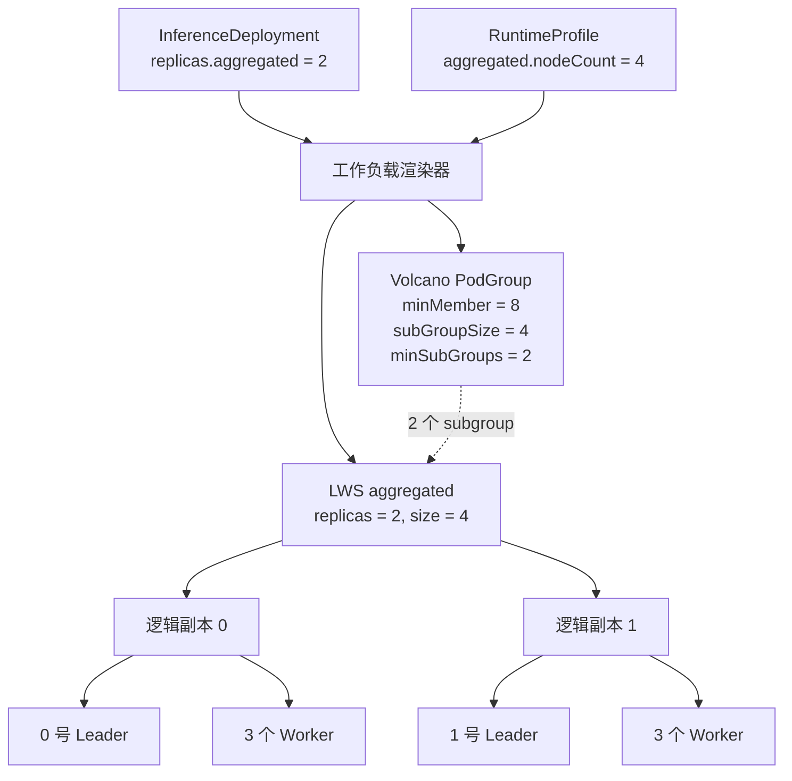
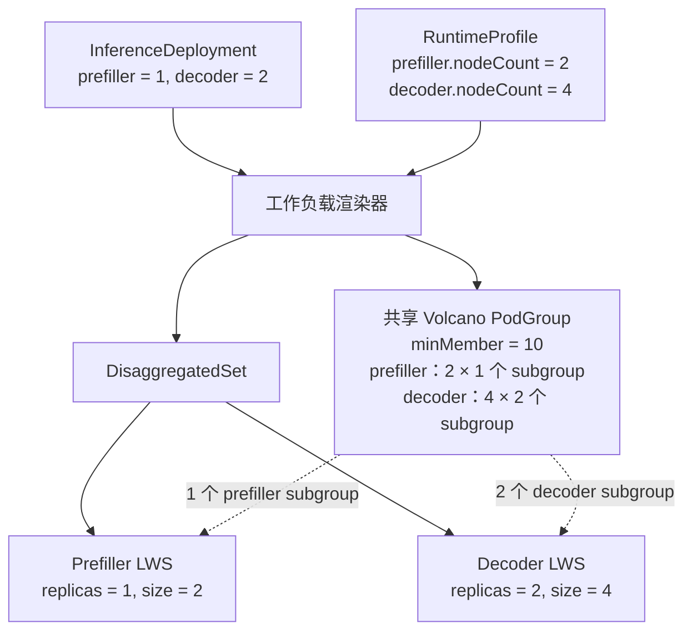

## 设计范围 {#design-scope}

FusionInfer 根据 [`RuntimeProfile`](./runtime-profile.md) 定义的每副本运行配置和 [`InferenceDeployment`](./inference-deployment.md) 的副本数生成 LeaderWorkerSet（LWS）、DisaggregatedSet 与 Volcano PodGroup。

## 核心概念 {#core-concepts}

InferenceDeployment 使用 `replicas.<role>` 控制每个角色运行多少个副本。在多节点场景中，一个副本可以由多个 Pod 共同组成，这些 Pod 共同构成一个“逻辑副本”：

- 单节点逻辑副本包含一个 Pod。
- 多节点逻辑副本包含一个 Leader Pod 和若干 Worker Pod。

RuntimeProfile 定义每个逻辑副本如何运行：

- `podTemplate` 定义该副本中 Pod 的镜像、资源和引擎参数。
- `multinode.nodeCount` 定义该副本包含多少个 Pod。
  - 未设置 `multinode` 时，`nodeCount` 按 1 处理。
  - 设置 `nodeCount: 4` 时，一个副本包含一个 Leader 和三个 Worker。

RuntimeProfile 中的 `nodeCount: 4` 表示每个逻辑副本包含四个 Pod：

```yaml {10}
apiVersion: fusioninfer.io/v1alpha1
kind: RuntimeProfile
metadata:
  name: vllm-aggregated-4node-r1
  namespace: team-a
spec:
  backend: vllm
  aggregated:
    multinode:
      nodeCount: 4
    podTemplate:
      spec:
        containers:
          - name: engine
            image: vllm/vllm-openai:v0.26.0
            args:
              - $(FUSION_MODEL_PATH)
              - --tensor-parallel-size
              - "8"
              - --pipeline-parallel-size
              - "4"
              - --data-parallel-size
              - "1"
            ports:
              - name: http
                containerPort: 8000
            resources:
              limits:
                nvidia.com/gpu: "8"
```

InferenceDeployment 中的 `aggregated: 2` 表示运行两个使用上述配置的副本：

```yaml {16}
apiVersion: fusioninfer.io/v1alpha1
kind: InferenceDeployment
metadata:
  name: qwen3-70b
  namespace: team-a
spec:
  modelRef:
    kind: ClusterModel
    name: qwen3-70b-r1
  runtimeRef:
    kind: RuntimeProfile
    name: vllm-aggregated-4node-r1
  cache:
    mode: eager
  replicas:
    aggregated: 2
  endpoint:
    gatewayRef:
      name: inference-gateway
      namespace: gateway-system
      sectionName: https
    hostnames:
      - qwen3-70b.example.com
    endpointPicker:
      strategy: prefix-cache
```

最终创建：

```text
逻辑副本 0：1 个 Leader + 3 个 Worker
逻辑副本 1：1 个 Leader + 3 个 Worker

总 Pod 数：2 × 4 = 8
```

## Aggregated 模式 {#aggregated-mode}

Aggregated 模式生成一个 LeaderWorkerSet：

- LWS `spec.replicas` 等于 `InferenceDeployment.spec.replicas.aggregated`。
- 每个 LWS group 表示一个 Aggregated 逻辑副本。
- `leaderWorkerTemplate.size` 等于 `nodesPerReplica(aggregated)`。
- `workerTemplate` 始终存在；多节点时额外生成 `leaderTemplate`，两者都来自同一份 RuntimeProfile `podTemplate`。
- LWS 使用 `startupPolicy: LeaderCreated`，让 Volcano 同时观察到一个副本中的全部 Pod。
- 只有 Leader Pod 注册为推理 Service 和 InferencePool Endpoint。

Volcano 根据 LWS 的逻辑副本身份把同一 group 中的 Leader 和 Worker 识别为一个 subgroup。即使单节点逻辑副本也使用 `size: 1` 的 LWS，使单节点与多节点共享同一生命周期、状态聚合和路由选择实现。

该配置使用两个逻辑副本，每个副本跨四个节点：

```yaml
apiVersion: fusioninfer.io/v1alpha1
kind: RuntimeProfile
metadata:
  name: vllm-aggregated-4node-r1
  namespace: team-a
spec:
  backend: vllm
  aggregated:
    multinode:
      nodeCount: 4
    podTemplate:
      spec:
        containers:
          - name: engine
            image: vllm/vllm-openai:v0.26.0
            args:
              - $(FUSION_MODEL_PATH)
              - --port
              - "8000"
              - --tensor-parallel-size
              - "8"
              - --pipeline-parallel-size
              - "4"
              - --data-parallel-size
              - "1"
            ports:
              - name: http
                containerPort: 8000
            resources:
              limits:
                nvidia.com/gpu: "8"
        nodeSelector:
          accelerator: h100
---
apiVersion: fusioninfer.io/v1alpha1
kind: InferenceDeployment
metadata:
  name: qwen3-70b
  namespace: team-a
spec:
  modelRef:
    kind: ClusterModel
    name: qwen3-70b-r1
  runtimeRef:
    kind: RuntimeProfile
    name: vllm-aggregated-4node-r1
  cache:
    mode: eager
  replicas:
    aggregated: 2
  endpoint:
    gatewayRef:
      name: inference-gateway
      namespace: gateway-system
      sectionName: https
    hostnames:
      - qwen3-70b.example.com
    endpointPicker:
      strategy: prefix-cache
```

RuntimeProfile 固定 `nodeCount: 4` 和每 Pod 八张 GPU；InferenceDeployment 只把逻辑副本数设为 2。因此 Controller 得到 `2 × 4 = 8` 个 Pod、`8 × 8 = 64` 张 GPU，创建一个 `replicas: 2`、`size: 4` 的 LWS，并让两个 LWS group 加入同一个 revision-scoped PodGroup。



### PodGroup {#podgroup}

`minMember: 8` 表示该 revision 的全局最低 Pod 数。`subGroupPolicy` 再把每个 LWS 逻辑副本的四个 Pod 组成原子调度单元：

```yaml
apiVersion: scheduling.volcano.sh/v1beta1
kind: PodGroup
metadata:
  name: qwen3-70b
  namespace: team-a
spec:
  minMember: 8
  minResources:
    nvidia.com/gpu: "64"
  subGroupPolicy:
    - name: aggregated
      labelSelector:
        matchLabels:
          fusioninfer.io/role: aggregated
      matchLabelKeys:
        - leaderworkerset.sigs.k8s.io/group-index
      subGroupSize: 4
      minSubGroups: 2
```

实际 `minResources` 聚合 RuntimeProfile 中参与 Gang scheduling 的资源请求；上例只展示 GPU。`minSubGroups: 2` 与 Deployment 的 `replicas.aggregated: 2` 对应，表示两个完整的四 Pod subgroup 都满足后，PodGroup 才满足该角色的最低要求。

### LeaderWorkerSet {#leaderworkerset}

两个逻辑副本合并在同一个 LWS 的 `spec.replicas` 中。LWS 配置和 backend 生成的 Leader/Worker 启动差异如下：

```yaml
apiVersion: leaderworkerset.x-k8s.io/v1
kind: LeaderWorkerSet
metadata:
  name: qwen3-70b-aggregated
  namespace: team-a
spec:
  replicas: 2
  startupPolicy: LeaderCreated
  rolloutStrategy:
    type: RollingUpdate
  leaderWorkerTemplate:
    size: 4
    leaderTemplate:
      spec:
        schedulerName: volcano
        containers:
          - name: engine
            image: vllm/vllm-openai:v0.26.0
            command:
              - vllm
              - serve
            args:
              - $(FUSION_MODEL_PATH)
              - --tensor-parallel-size
              - "8"
              - --pipeline-parallel-size
              - "4"
              - --data-parallel-size
              - "1"
              - --distributed-executor-backend
              - mp
              - --nnodes
              - "4"
              - --master-addr
              - $(LWS_LEADER_ADDRESS)
              - --master-port
              - "29500"
              - --node-rank
              - "0"
            ports:
              - name: http
                containerPort: 8000
            resources:
              limits:
                nvidia.com/gpu: "8"
    workerTemplate:
      spec:
        schedulerName: volcano
        containers:
          - name: engine
            image: vllm/vllm-openai:v0.26.0
            command:
              - vllm
              - serve
            args:
              - $(FUSION_MODEL_PATH)
              - --tensor-parallel-size
              - "8"
              - --pipeline-parallel-size
              - "4"
              - --data-parallel-size
              - "1"
              - --distributed-executor-backend
              - mp
              - --nnodes
              - "4"
              - --master-addr
              - $(LWS_LEADER_ADDRESS)
              - --master-port
              - "29500"
              - --node-rank
              - $(LWS_WORKER_INDEX)
              - --headless
            resources:
              limits:
                nvidia.com/gpu: "8"
```

LWS Controller 从该对象创建两个 group，每个 group 包含一个 Leader 和三个 Worker，并注入 `LWS_LEADER_ADDRESS` 等组内发现信息：

```text
逻辑副本 0：1 个 Leader + 3 个 Worker
逻辑副本 1：1 个 Leader + 3 个 Worker
```

Volcano 将其识别为两个四 Pod subgroup。单节点 Aggregated 部署使用相同的 PodGroup 结构，只是每个 subgroup 的 `subGroupSize` 为 1。

## P/D 分离模式 {#disaggregated-pd-mode}

Prefill/Decode Profile 同时包含 `prefiller` 和 `decoder`。Controller 为整个 P/D revision 生成一个 DisaggregatedSet；每个 role 映射为一个由 DisaggregatedSet 管理的 LeaderWorkerSet。两个角色可以拥有不同的 Pod 模板、逻辑副本数和 `nodeCount`，DisaggregatedSet 负责统一 revision、协调 rollout、角色状态和 Headless Service。

该映射要求集群安装包含 `disaggregatedset.x-k8s.io/v1` CRD 的 LeaderWorkerSet v0.9.0 或更高版本。Controller 在启动时发现该 API；缺少时，P/D InferenceDeployment 将 `WorkloadsReady` Condition 设为 `False`，`reason` 为 `DisaggregatedSetUnavailable`。

该配置规定每个 Prefiller 副本使用两个节点、每个 Decoder 副本使用四个节点。InferenceDeployment 请求一个 Prefiller 副本和两个 Decoder 副本：

```yaml
apiVersion: fusioninfer.io/v1alpha1
kind: ClusterRuntimeProfile
metadata:
  name: vllm-pd-2x4-h100-r1
spec:
  backend: vllm
  prefiller:
    multinode:
      nodeCount: 2
    podTemplate:
      spec:
        containers:
          - name: engine
            image: vllm/vllm-openai:v0.26.0
            args:
              - $(FUSION_MODEL_PATH)
              - --port
              - "8000"
              - --tensor-parallel-size
              - "16"
              - --data-parallel-size
              - "1"
              - --kv-transfer-config
              - '{"kv_connector":"NixlConnector","kv_role":"kv_producer"}'
            ports:
              - name: http
                containerPort: 8000
            resources:
              limits:
                nvidia.com/gpu: "8"
        nodeSelector:
          accelerator: h100
  decoder:
    multinode:
      nodeCount: 4
    podTemplate:
      spec:
        containers:
          - name: engine
            image: vllm/vllm-openai:v0.26.0
            args:
              - $(FUSION_MODEL_PATH)
              - --port
              - "8000"
              - --tensor-parallel-size
              - "8"
              - --pipeline-parallel-size
              - "4"
              - --data-parallel-size
              - "1"
              - --kv-transfer-config
              - '{"kv_connector":"NixlConnector","kv_role":"kv_consumer"}'
            ports:
              - name: http
                containerPort: 8000
            resources:
              limits:
                nvidia.com/gpu: "8"
        nodeSelector:
          accelerator: h100
---
apiVersion: fusioninfer.io/v1alpha1
kind: InferenceDeployment
metadata:
  name: qwen3-pd
  namespace: team-a
spec:
  modelRef:
    kind: ClusterModel
    name: qwen3-70b-r1
  runtimeRef:
    kind: ClusterRuntimeProfile
    name: vllm-pd-2x4-h100-r1
  cache:
    mode: eager
  replicas:
    prefiller: 1
    decoder: 2
  endpoint:
    gatewayRef:
      name: inference-gateway
      namespace: gateway-system
      sectionName: https
    hostnames:
      - qwen3-pd.example.com
```

`endpoint.endpointPicker` 被省略，因为 P/D 路由由 `prefiller + decoder` 角色组合推断。两个角色分别根据自己的 `nodeCount` 和 `replicas` 计算 Pod 数：

```text
prefiller Pod 数 = 1 × 2 = 2
decoder Pod 数   = 2 × 4 = 8
Pod 总数         = 10
```



### PodGroup {#podgroup-1}

P/D 的两个角色加入同一个 PodGroup，但各自拥有独立的 subgroup 规则：

```yaml
apiVersion: scheduling.volcano.sh/v1beta1
kind: PodGroup
metadata:
  name: qwen3-pd
  namespace: team-a
spec:
  minMember: 10
  subGroupPolicy:
    - name: prefiller
      labelSelector:
        matchLabels:
          fusioninfer.io/role: prefiller
      matchLabelKeys:
        - leaderworkerset.sigs.k8s.io/group-index
      subGroupSize: 2
      minSubGroups: 1
    - name: decoder
      labelSelector:
        matchLabels:
          fusioninfer.io/role: decoder
      matchLabelKeys:
        - leaderworkerset.sigs.k8s.io/group-index
      subGroupSize: 4
      minSubGroups: 2
```

该配置要求至少一个完整 Prefiller subgroup 和两个完整 Decoder subgroup。`minMember: 10` 同时要求这三个 subgroup 的十个 Pod 都进入 PodGroup 的最低调度集合。

### DisaggregatedSet {#disaggregatedset}

InferenceDeployment Controller 把两个 RuntimeProfile 角色编译为同一个 DisaggregatedSet。角色、副本和节点数的映射如下：

```yaml
apiVersion: disaggregatedset.x-k8s.io/v1
kind: DisaggregatedSet
metadata:
  name: qwen3-pd
  namespace: team-a
spec:
  roles:
    - name: prefiller
      spec:
        replicas: 1
        startupPolicy: LeaderCreated
        leaderWorkerTemplate:
          size: 2
          leaderTemplate:
            spec:
              schedulerName: volcano
              containers:
                - name: engine
                  image: vllm/vllm-openai:v0.26.0
          workerTemplate:
            spec:
              schedulerName: volcano
              containers:
                - name: engine
                  image: vllm/vllm-openai:v0.26.0

    - name: decoder
      spec:
        replicas: 2
        startupPolicy: LeaderCreated
        leaderWorkerTemplate:
          size: 4
          leaderTemplate:
            spec:
              schedulerName: volcano
              containers:
                - name: engine
                  image: vllm/vllm-openai:v0.26.0
          workerTemplate:
            spec:
              schedulerName: volcano
              containers:
                - name: engine
                  image: vllm/vllm-openai:v0.26.0
```

DisaggregatedSet Controller 为每个 role 生成一个 child LWS，并管理两个角色的协调 rollout 与 Headless Service。

### 角色 LeaderWorkerSet {#role-leaderworkersets}

DisaggregatedSet 为每个角色创建一个 LWS。其核心映射如下：

```yaml
# Prefiller
kind: LeaderWorkerSet
spec:
  replicas: 1
  startupPolicy: LeaderCreated
  leaderWorkerTemplate:
    size: 2
---
# Decoder
kind: LeaderWorkerSet
spec:
  replicas: 2
  startupPolicy: LeaderCreated
  leaderWorkerTemplate:
    size: 4
```

Prefiller LWS 创建一个两 Pod 逻辑副本，Decoder LWS 创建两个四 Pod 逻辑副本。角色模板中的 Leader/Worker 启动配置来自同一份 RuntimeProfile `podTemplate` 和 backend adapter。

P/D 部署即使所有逻辑副本都是单节点，也使用共享 PodGroup 协调 Prefiller 与 Decoder 的最低可用集合。DisaggregatedSet 负责角色工作负载，FusionInfer 负责模型物化、共享 PodGroup 和 GAIE 路由。Endpoint Picker 和 InferencePool 只在待发布 revision 的期望角色全部就绪后切换流量。

## Backend 分布式运行 {#backend-distributed-execution}

RuntimeProfile 为每个推理角色提供一份 `podTemplate`。Controller 从该模板生成 Leader 和 Worker 配置，再由 backend adapter 修改 `engine` 容器的启动参数。`backend` 只选择适配器，不选择镜像、模型或并行度。

### Leader 与 Worker 启动 {#leader-and-worker-startup}

未设置 `multinode` 时，adapter 不添加跨节点启动参数。设置 `multinode` 后，同一份模板按角色生成两份配置：

- Leader 使用 rank 0，建立分布式运行环境并启动对外提供 HTTP 服务的推理进程。
- Worker 使用 LWS 分配的 rank 加入 Leader，不注册为 Service 或 InferencePool Endpoint。
- 镜像、TP/PP/DP、资源、环境变量、volume 和调度约束来自原始 `podTemplate`。
- Worker 不运行 HTTP 服务时，adapter 删除从原始模板继承的 HTTP readiness、liveness 和 startup probe。

LeaderWorkerSet 提供以下组内信息：

```text
LWS_LEADER_ADDRESS   Leader Pod 的组内地址
LWS_WORKER_INDEX     Worker 在当前 group 中的索引
LWS_GROUP_SIZE       当前 group 的总 Pod 数
```

backend adapter 把这些值转换为对应引擎的 executor、地址、rank 和节点数参数。RuntimeProfile 不能声明 adapter 管理的 executor、地址、rank、`nnodes` 或 headless 参数；发生冲突时 Controller 拒绝生成工作负载。

### vLLM {#vllm}

多节点 vLLM 固定使用原生 multiprocessing executor。RuntimeProfile 只声明模型和 TP/PP/DP 等引擎参数；backend adapter 为每个 Pod 注入 `--distributed-executor-backend mp` 及组内启动参数。

每个 Pod 都运行 `vllm serve`。Leader 使用：

```text
--distributed-executor-backend mp
--nnodes 4
--master-addr $(LWS_LEADER_ADDRESS)
--master-port 29500
--node-rank 0
```

Worker 使用相同的模型和并行参数，并以 headless 模式加入分布式进程组：

```text
--distributed-executor-backend mp
--nnodes 4
--master-addr $(LWS_LEADER_ADDRESS)
--master-port 29500
--node-rank $(LWS_WORKER_INDEX)
--headless
```

Leader 对外提供 HTTP 服务，Worker 只参与分布式执行。adapter 在 Worker 启动前等待 Leader 的 multiprocessing rendezvous 端口可用。TP/PP/DP 保持 RuntimeProfile 中的原值，不根据 `nodeCount` 自动调整。

### SGLang {#sglang}

SGLang 使用原生分布式启动。Profile 作者声明模型参数、`--tp-size`、`--dp-size` 和每 Pod GPU 资源，adapter 为每个 Pod 增加 `dist-init-addr`、`nnodes` 和 `node-rank`。

Leader 使用：

```bash
python3 -m sglang.launch_server \
  --model-path "${FUSION_MODEL_PATH}" \
  --tp-size 16 \
  --dp-size 1 \
  --dist-init-addr "${LWS_LEADER_ADDRESS}:29500" \
  --nnodes 2 \
  --node-rank 0
```

Worker 使用相同的引擎参数，只替换 rank：

```bash
python3 -m sglang.launch_server \
  --model-path "${FUSION_MODEL_PATH}" \
  --tp-size 16 \
  --dp-size 1 \
  --dist-init-addr "${LWS_LEADER_ADDRESS}:29500" \
  --nnodes 2 \
  --node-rank "${LWS_WORKER_INDEX}"
```

只有 rank 0 提供 HTTP 服务。其他 rank 运行 SGLang scheduler 和分布式计算进程，但不注册为可路由 Endpoint。

### 参数所有权与校验 {#parameter-ownership-and-validation}

RuntimeProfile 固定模型参数、TP/PP/DP、镜像和每 Pod 资源。backend adapter 固定 vLLM 的 multiprocessing executor，并添加随 Leader/Worker 变化的地址、rank、节点数和 headless 参数；LWS 提供 group 内的地址与索引。

adapter 只接受 Operator 版本明确支持的入口形式，例如 `vllm serve` 和 `python3 -m sglang.launch_server`。它可以识别有限且有版本约束的参数，但不会解析任意 shell 脚本，也不会验证模型结构与 TP/PP/DP 的数学兼容性。无法识别的入口、重复的保留参数或不支持的参数组合都会使新工作负载保持未创建状态。

## Gang Scheduling {#gang-scheduling}

Aggregated 和 P/D 分离模式都使用 Volcano Gang scheduling，无论副本包含一个还是多个 Pod。

Controller 在创建 standalone LWS 或 DisaggregatedSet 前创建一个 revision-scoped PodGroup。该 PodGroup 汇总所有逻辑副本：

```text
minMember =
    Σ replicas(role) × nodesPerReplica(role)

subGroupPolicy[role].subGroupSize =
    nodesPerReplica(role)

subGroupPolicy[role].minSubGroups =
    replicas(role)
```

两个层次承担不同职责：

- `minMember` 是整个 revision 的全局最低 Pod 数，并与 `minResources` 一起参与 PodGroup 准入。
- `subGroupPolicy` 按角色和 LWS 逻辑副本形成 subgroup。
- `subGroupSize` 保证一个逻辑副本的 Leader 和 Worker 作为原子单元调度。
- `minSubGroups` 保证该角色至少有多少个完整逻辑副本满足调度条件。

增加副本时，Controller 更新 standalone LWS 的 `spec.replicas` 或 DisaggregatedSet role 的 `spec.replicas`，并更新 PodGroup 的 `minMember` 和对应角色的 `minSubGroups`。每个角色只需要一条 `subGroupPolicy`。

### PodGroup 准入语义 {#podgroup-admission-semantics}

PodGroup 使用全局准入和逻辑副本原子性两个层次：

- `minMember` 定义整个 revision 的最低 Pod 数。
- `subGroupSize` 定义每个逻辑副本包含的 Pod 数。
- `minSubGroups` 定义对应角色要求的完整逻辑副本数。

两个四节点 Aggregated 副本对应 `minMember: 8`、`subGroupSize: 4` 和 `minSubGroups: 2`。每个四 Pod 逻辑副本作为一个 subgroup 调度，两个 subgroup 共同构成该 revision 的最低可用集合。

共享 PodGroup 的 `minMember` 覆盖待发布 revision 的全部期望成员，因此该 revision 不支持只调度部分期望容量。资源不足时新 LWS 保持 Pending，上一 active revision 继续接收流量。该行为与“所有期望逻辑副本 Ready 后才提升 revision”的发布条件一致。

Controller 把生成的 Pod `schedulerName` 设置为 Operator 配置的 Volcano scheduler。RuntimeProfile 中的 `schedulerName` 必须为空或与该值一致；冲突值会被拒绝，不进行静默覆盖。

`SubGroupPolicy` 需要 Volcano v1.14 或更高版本。Operator 启动时必须发现 PodGroup CRD 是否包含 `spec.subGroupPolicy`；缺少该能力时，InferenceDeployment 将 `WorkloadsReady` Condition 设为 `False`，`reason` 为 `UnsupportedVolcanoVersion`，不能静默退化为只有 `minMember` 的调度。

## 扩缩容 {#scaling}

只修改 InferenceDeployment 的 `replicas` 不改变 RuntimeProfile 中的节点数、Pod 资源或引擎参数：

- Aggregated 扩缩容更新 standalone LWS 的 `spec.replicas`。
- P/D 扩缩容更新 DisaggregatedSet 对应 role 的 `spec.replicas`，DisaggregatedSet 再驱动 child LWS。
- 扩容时同步更新 PodGroup 的 `minMember`、对应角色的 `subGroupPolicy.minSubGroups` 和 `minResources`；`subGroupSize` 不变。
- 缩容时先停止把待删除逻辑副本的 Leader 作为可路由 Endpoint，再降低 role replicas 并收缩 PodGroup。
- `nodeCount`、Pod 资源或 TP/PP/DP 不能通过 Deployment 扩缩；这些变化需要新 RuntimeProfile 和完整 revision rollout。

部署使用动态 LoRA 时，新增逻辑副本只有在全部声明的 LoRA 加载完成后才加入可路由 Endpoint 集合；删除副本时先停止新的 Base Model 和 LoRA 请求，再卸载绑定并缩减 LWS group。预加载模式不增加独立步骤，因为 LoRA 已属于该 workload revision。

Gang 扩容所需资源不足时，原有逻辑副本保持服务，Deployment 报告 `Progressing=True` 和 `WorkloadsReady=False`。Controller 不通过先删除已有副本来为新副本腾出资源。

## Rollout 与失败处理 {#rollout-and-failure-handling}

Model、RuntimeProfile 或缓存模式变化会产生新的 template hash。Controller 为 pending revision 创建独立的预热任务、PodGroup、standalone LWS 或 DisaggregatedSet、角色 Service 和 Endpoint Picker，不原地修改 active revision 的 Pod 模板。

`loadingMode: preload` 时，解析后的 LoRA 引用、digest 和 `servedName` 参与 template hash，绑定变化采用同样的完整 rollout。`loadingMode: dynamic` 时，LoRA 集合使用独立的 binding revision；加载或卸载失败不会替换 Base Model workload，也不会影响其他已经 Ready 的 LoRA。

只有以下条件同时满足时才提升新 revision：

- 所需模型副本已经物化。
- 预加载模式下，全部 LoRA 已物化并随引擎启动成功。
- 每个逻辑副本的 Leader 和全部 Worker 都 Ready。
- Aggregated 或 Prefill/Decode 的全部期望逻辑副本 Ready。
- 角色 Service 已产生 Ready Endpoint。
- Endpoint Picker 和 InferencePool 已就绪。

PodGroup 无法调度、LWS 或 DisaggregatedSet 启动失败、角色协调 rollout 失败或 backend adapter 拒绝模板时，Controller 保留 active revision，通过 InferenceDeployment Conditions 报告失败原因。删除 InferenceDeployment 时同步回收其工作负载和路由资源；节点模型缓存按全局保留策略独立回收。

## Status 映射 {#status-mapping}

`InferenceDeployment.status.components.<role>` 按逻辑副本汇总底层状态：

- `desiredReplicas` 来自 `spec.replicas.<role>`。
- `nodesPerReplica` 来自 RuntimeProfile 的 `multinode.nodeCount`，未设置时为 1。
- Aggregated 的 `readyReplicas` 来自 standalone LWS 的 group Ready 状态。
- Prefiller 和 Decoder 的 `readyReplicas` 来自 DisaggregatedSet role status 与对应 child LWS；只有 group 内全部成员 Pod Ready 才计入。
- `readyPods` 记录当前 Ready Pod 总数。

用户通过 `WorkloadsReady`、`Progressing` 和 `Degraded` Conditions 获取工作负载调和结果。
